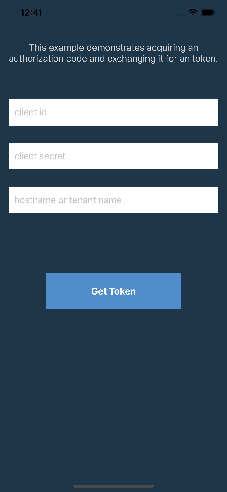
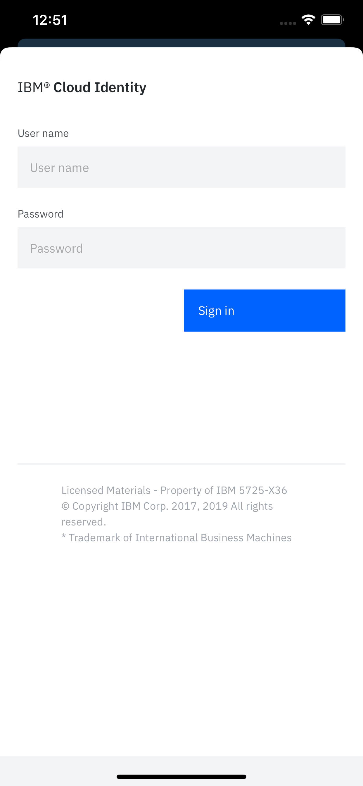
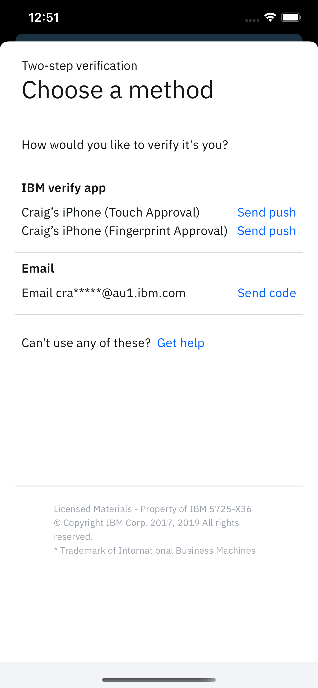
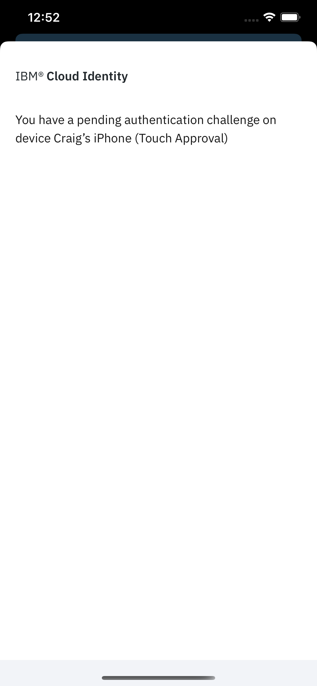
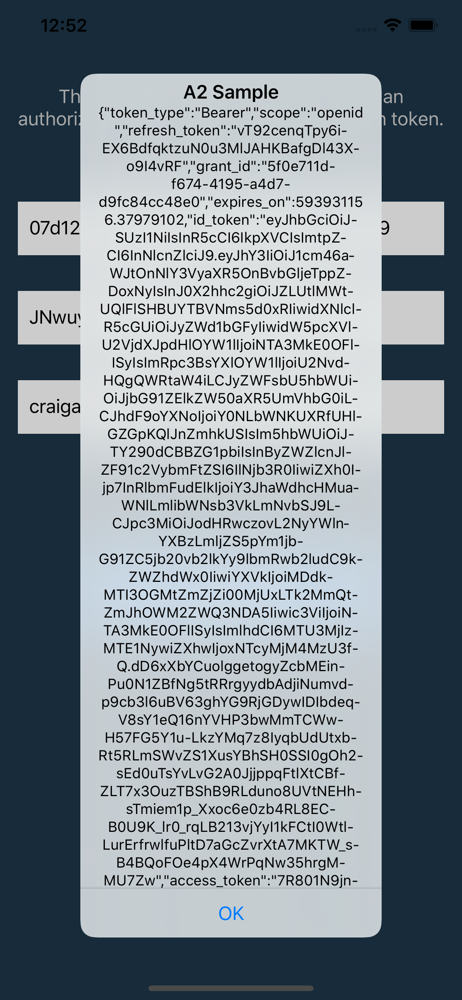

# OIDC token using authorization code (ANZ) flow
This example demonstrates acquiring a token using a hybrid web view.
 

### Screenshots

# License

This sample app is intended solely for use with an Apple iOS product and intended to be used in conjunction with officially licensed Apple development tools and further customized and distributed under the terms and conditions of your licensed Apple developer program.

    Copyright 2017 International Business Machines

    Licensed under the Apache License, Version 2.0 (the "License");
    you may not use this file except in compliance with the License.
    You may obtain a copy of the License at

        http://www.apache.org/licenses/LICENSE-2.0

    Unless required by applicable law or agreed to in writing, software
    distributed under the License is distributed on an "AS IS" BASIS,
    WITHOUT WARRANTIES OR CONDITIONS OF ANY KIND, either express or implied.
    See the License for the specific language governing permissions and
    limitations under the License.
